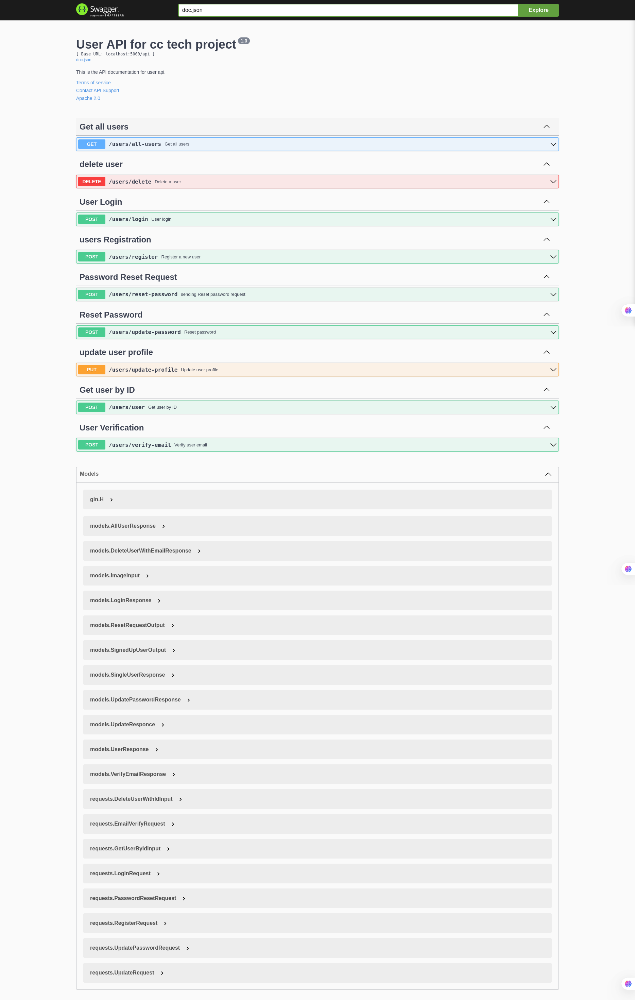

# Book Renting App

This is a **Project** developed for the **CC-Tech** internship **entrance test**. The backend is developed using **Golang**, **PostgreSQL**, and **Hasura GraphQL**, and runs with **Docker**.

## Features

- **User Authentication**
  - Custom authentication using **JWT**
  - OAuth authentication via **Google** and **GitHub**
- **GraphQL API with Hasura**
- **Password hashing with bcrypt**
- **Image Uploading with Cloudinary**
- **Email Verification & Password Reset via Google SMTP**
- **Go GraphQL Client for Hasura**
- **Gin Framework for API Routing**

## Getting Started

### Prerequisites

- Docker
- Golang
- Hasura CLI

### Installation

1. Clone the repository:
   ```sh
   git clone [https://github.com/LidoHon/CC-tech-project-server.git](https://github.com/LidoHon/CC-tech-project-server.git)
   cd CC-tech-project-server
   ```
2. Set up your environment variables in a `.env` file:

   ```ini
   PORT=
   POSTGRES_USER=
   POSTGRES_PASSWORD=
   POSTGRES_DB=
   HASURA_GRAPHQL_PORT=
   ACTION_BASE_URL=
   HASURA_GRAPHQL_ADMIN_SECRET=
   HASURA_ACTION_SECRET=
   HASURA_GRAPHQL_DATABASE_URL=
   HASURA_GRAPHQL_API_ENDPOINT=
   HASURA_GRAPHQL_ENDPOINT=
   JWT_SECRET_KEY=
   RESET_PASS_URL=
   RETURN_URL=
   EMAIL_HOST=
   EMAIL_USERNAME=
   GOOGLE_EMAIL_PASSWORD=
   EMAIL_PASSWORD=
   FROM_EMAIL=
   SERVICE=
   GMAIL_HOST=
   GMAIL_PORT=
   EMAIL_PORT=
   CLOUD_NAME=
   CLOUDINARY_API_KEY=
   CLOUDINARY_API_SECRET=
   CLOUDINARY_URL=
   BASE_URL=
   CLIENT_LOGIN_URL=
   CLIENT_HOMEPAGE_URL=
   GOOGLE_CLIENT_ID=
   GOOGLE_CLIENT_SECRET=
   GITHUB_CLIENT_ID=
   GITHUB_CLIENT_SECRET=
   SESSION_SECRET=
   ```

3. Start the services using Docker:

- After making sure all environment variables are correctly set and run:
  ```sh
  docker-compose up -d
  ```

4. Run the Go Backend

   - **Navigate to the Go app directory:**

   ```sh
   cd go-app
   ```

   - **Run the app:**

     - Using `go run`:

     ```sh
     go run main.go
     ```

     - Using `air` (for live reloading):

     ```sh
     air
     ```

     - Using a Makefile:

     ```sh
     make run-go-app
     ```

## For Hasura Console

- Run Hasura Console using the CLI:

```

hasura console --admin-secret "<your admin secret>"
```

This will start the Hasura console at: http://localhost:9695/

- Apply Migrations
  To apply database migrations, run:

```
hasura migrate apply --admin-secret "<your admin secret>"
```

This ensures that all database changes (schemas, tables, etc.) are applied to your Hasura instance.

- Apply Metadata
  To apply Hasura metadata (permissions, relationships, etc.), use:

```

hasura metadata apply --admin-secret "<your admin secret>"
```

This syncs the metadata with the Hasura GraphQL engine, ensuring that all API configurations are correctly applied.

## API Documentation

To generate or update the API documentation, run:

```sh
swag init --parseDependency --parseInternal
```

or just

```sh
swag init
```

- Then, open your browser and visit:

```sh
http://localhost:<port>/swagger/index.html#/
```

Replace <port> with your actual server port.


